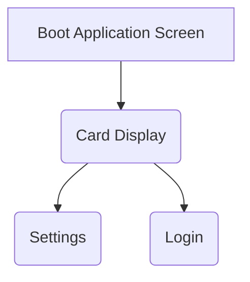

# Django Date App Planning

# Scope and Requirements
For this project I want to create an app for date ideas, and show few options with the option to reroll (similar to my final year project with meals).
For the MVP of the application I just want to have a MongoDB that has a list of ideas that will display 

# Moscow for App

## Must
* Display date ideas to the user (such as ice skating, pottery etc.)
* Have a database upon which these date ideas are stored.

## Should
* Be able to filter out by requirements (activity type, time of day, price etc.)
* Be able to add to the database through the admin portal provided by django.

## Could
* Have user addable date ideas.
* Have a search button with the location taken into account through google maps.
* Have the user be able to save their requirements or individually blacklist date ideas.

## Would
* Be hosted on AWS with Docker.
* Have a separate non-localhosted database which is hosted on mongodb cloud or aws.

# Feature List
Skeleton App with UI
Cards Displaying Date Ideas
Reroll function
Additional tags displayed to user optionally
Filtering options
Admin Portal
User Accounts (google oauth)
User preferences
User added content
Google Maps API integrations

# UI and Navigation Planning

# Database Design (MongoDB)
Initially we'll just have a few elements that will be useful:
* Name of Activity
* Type of Activity (tags)
    * Active
    * Meal
    * Slow (like a walk or something)
    * Learning (Pottery)
* Time(s) of day for Activity
* Price of Activity
# API integrations
Google Maps API to find places for the relevant keywords in a given city or location (within x amount of miles)
I do *not* want to use location data from the browser for this, I instead would like the user to input desired location.
